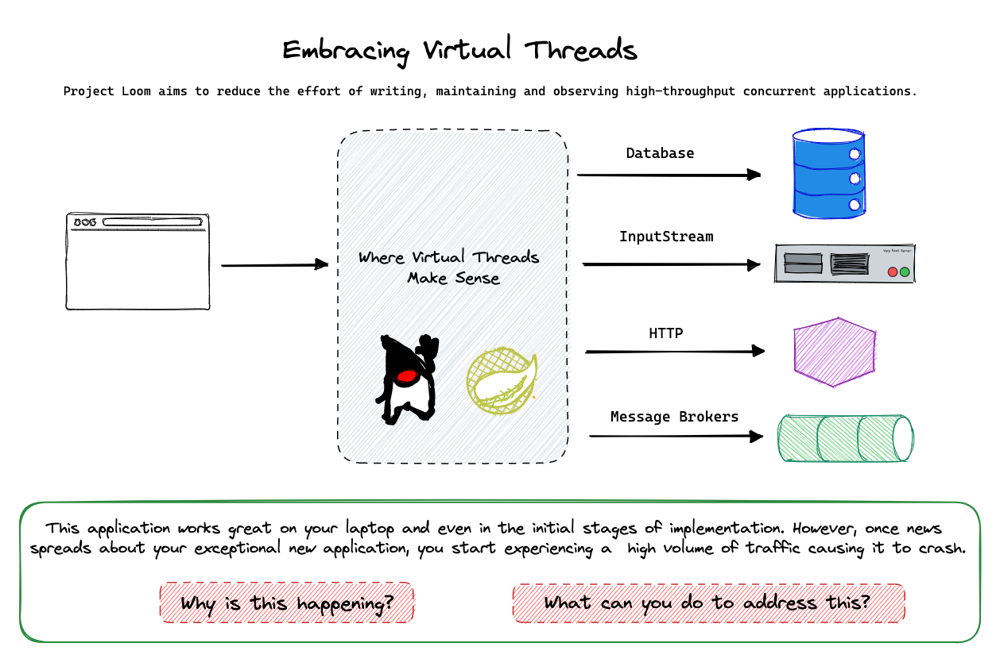
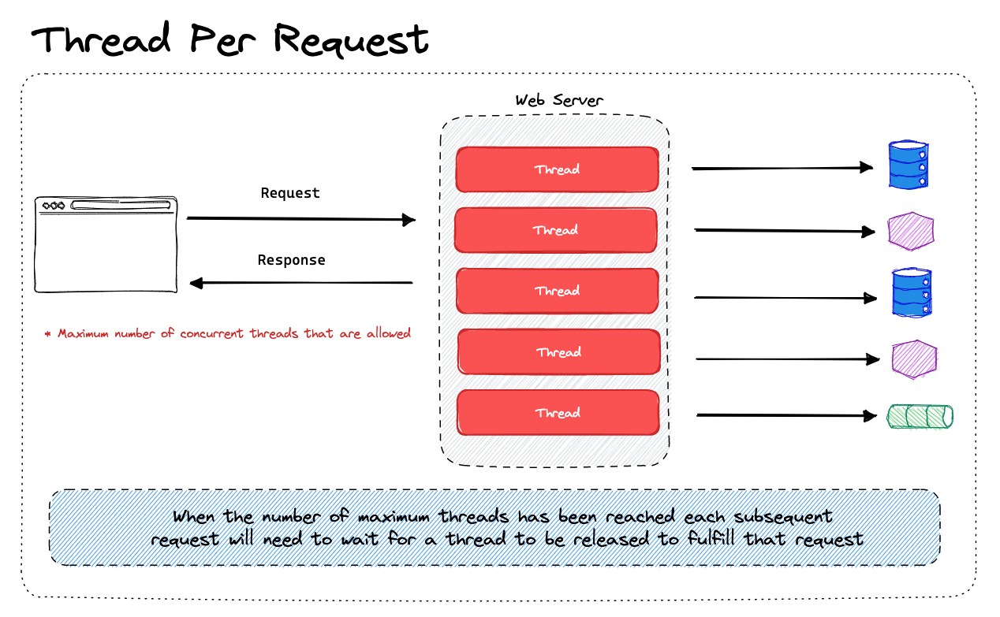
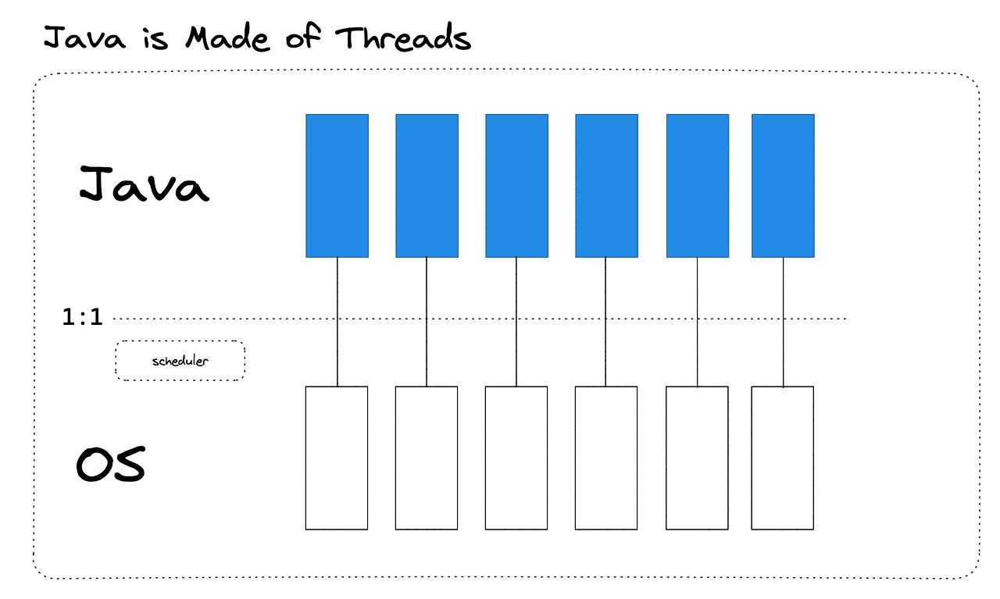
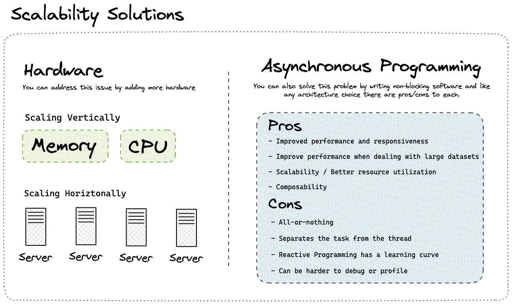
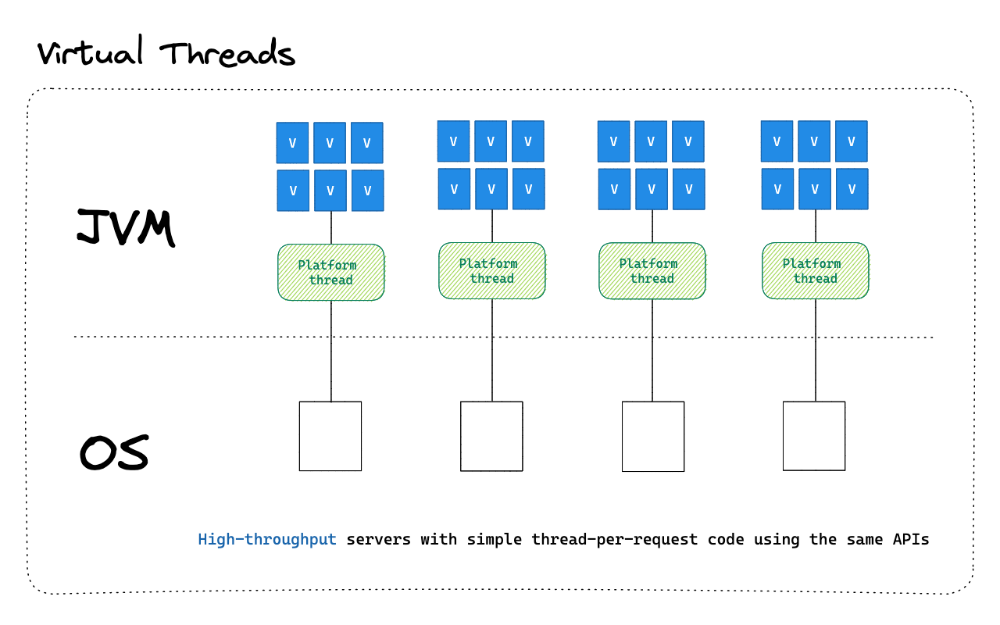
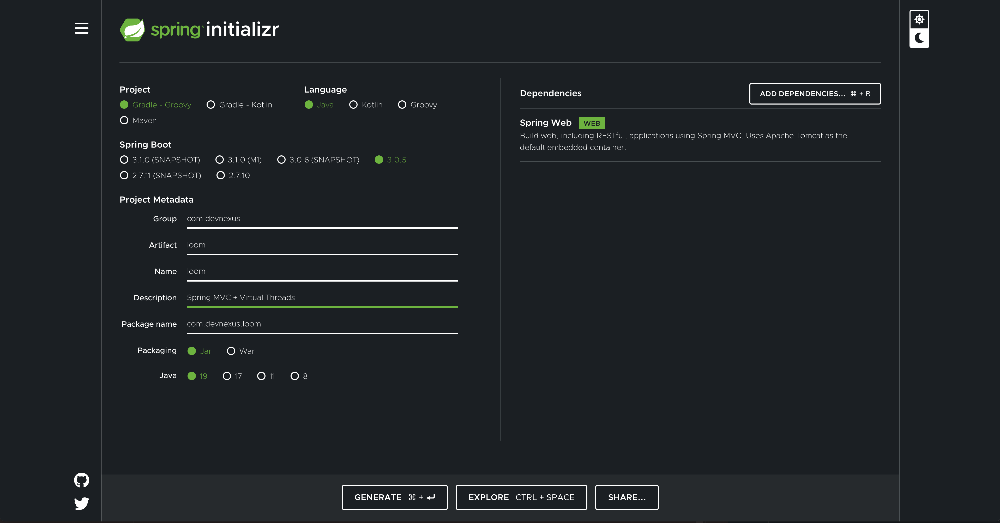

# Spring Boot + Project Loom

In this project you will learn about how threads currently work in Java and what problems Project Loom intends to solve. First we will start with a refresher on how threads work and then a quick demo of how to use Virtual Threads in Spring. 

## Embracing Virtual Threads

Project Loom aims to reduce the effort of writing, maintaining and observing high-throughput thread-based applications. In the following example we have a typical Spring MVC application that performs blocking operations like connecting to a database, writing a file to disk, making a network call to another service or working with a message broker. 



When these types of applications experience higher throughput than they are able to handle they will end up crashing. Why is this happening? What can you do to prevent this from happening?

## Thread Per Request Model

The thread-per-request model is a common pattern in web applications. It is a simple model where each request is handled by a separate thread. This model is easy to understand and implement. However, it has some drawbacks. When a thread has perform a blocking operation like connecting to a database or making a network call it will be blocked until the operation is complete. This means that the thread will not be able to handle any other requests.



## Java is made of Threads

A thread in Java is tied to an Operating System thread. This means that each thread in Java will consume a thread in the Operating System. This is a problem because the Operating System has a limit on the number of threads it can handle.



## Scalability Solutions

There are a few solutions to the thread-per-request model. One solution is to add more hardware. This will allow you to increase the number of threads that the Operating System can handle. Another solution is to use asynchronous programming. This will allow you to use a single thread to handle multiple requests.



## Virtual Threads

Project Loom introduces a new type of thread called a virtual thread. A virtual thread is a thread that is not tied to an Operating System thread. This means that you can create as many virtual threads as you want without worrying about the Operating System thread limit.



The nice thing about Virtual Threads in Spring is that for the most part you won't have to change your code. You can continue to write your code in a blocking manner and Spring will take care of the rest. 

While we are in a preview mode there are a few things you will need to do to enable Virtual Threads in Spring. When Virtual Threads are no longer in preview mode you will be able to use them with little to no configuration.

## Virtual Threads in Spring Demo

Before you can run this demo you will need to make sure you have Java 19 installed. 

```shell
java --version
java 19.0.2 2023-01-17
Java(TM) SE Runtime Environment (build 19.0.2+7-44)
Java HotSpot(TM) 64-Bit Server VM (build 19.0.2+7-44, mixed mode, sharing)
```

Next create a new Spring Boot project using the Spring Initializr. 



To enable a preview feature in Java you will need to add the following to your `pom.xml` file: 


```xml
<build>
    <plugins>
        <plugin>
            <groupId>org.springframework.boot</groupId>
            <artifactId>spring-boot-maven-plugin</artifactId>
        </plugin>
        <plugin>
            <groupId>org.apache.maven.plugins</groupId>
            <artifactId>maven-compiler-plugin</artifactId>
            <configuration>
                <compilerArgs>--enable-preview</compilerArgs>
                <source>19</source>
                <target>19</target>
            </configuration>
        </plugin>
    </plugins>
</build>
```

Create a new controller called `HomeController` with a method that returns the current thread.

```java
@RestController
public class HomeController {

    @GetMapping("/")
    public String hello() {
        return Thread.currentThread().toString();
    }

}
```

If you run the application you should see that you are currently using the main thread.


```shell
curl http://localhost:8080/
Thread[#39,http-nio-8080-exec-1,5,main]%       
```

Next you will need to configure Tomcat to use the VirtualThreadPerTaskExecutor. This creates an `Executor` that starts a new virtual thread for each task. The number of threads created by the Executor is unbounded.

```java
@SpringBootApplication
public class Application {

    private static final Logger log = LoggerFactory.getLogger(Application.class);

    public static void main(String[] args) {
        SpringApplication.run(Application.class, args);
    }

    @Bean
    TomcatProtocolHandlerCustomizer<?> protocolHandlerVirtualThreadExecutorCustomizer() {
        return protocolHandler -> {
            log.info("Configuring " + protocolHandler + " to use VirtualThreadPerTaskExecutor");
            protocolHandler.setExecutor(Executors.newVirtualThreadPerTaskExecutor());
        };
    }

}
```

Run the application again and hit the `/` endpoint and you should now see that you are using a virtual thread.

```shell
curl http://localhost:8080/
VirtualThread[#49]/runnable@ForkJoinPool-1-worker-1%       
```

## Resources

- [Embracing Virtual Threads](https://spring.io/blog/2022/10/11/embracing-virtual-threads)
- [Web Applications & Project Loom](https://spring.io/blog/2023/02/27/web-applications-and-project-loom)
- [Project Loom](https://jdk.java.net/loom/) 
